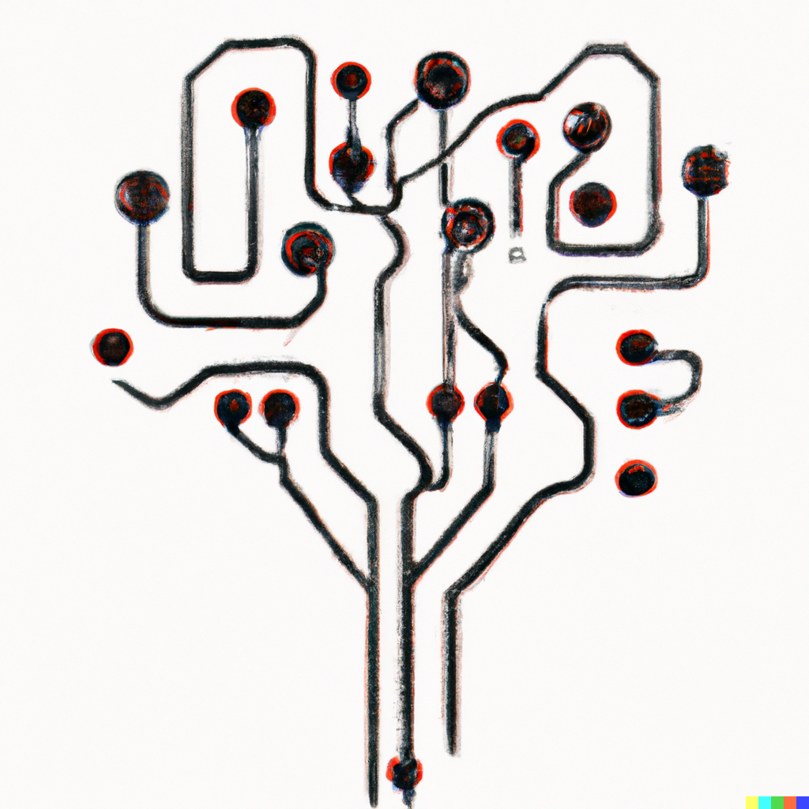

# ENIGMA 
> Exploring Neural Information and Generating Model-based Analysis: Neural Recordings, Temporal Dynamics and Deep Learning with Python
___

**A framework for prediciting neural dyanmics from experimental data with deep learning**

Understanding neuromodulatory dynamics and impact on behavior is incomplete despite extensive research. We provide a novel tool-kit to extract bidirectionally predictive behavioral features and neural activity. Through application we aim to understand and extract unanticipated neural correlates, aid in the the discovery of insights into its temporal dynamics and predictive features, and advance knowledge in health and disease.

| note that ENIGMA is currently a work in progress and updated on a daily basis. If you would like to contribute please reachout to me at michael.schaid@northwestern.edu

## Basic Features
The ENIGMA project provides the following basic features:

### Preprocessing
The preprocessing module provides tools to clean and preprocess raw neural data.

### Data Processing
The data processing module provides tools to process preprocessed data and extract behavioral features.

### Modeling
The modeling module provides tools to train deep learning models on the processed data.

### Inference and visualization
The inference and visualization module provides tools to make predictions on new data and visualize the results.

### Deployment
The deployment module provides tools to deploy the trained models in production environments.

### Getting Started
To get started with the ENIGMA project, follow these steps:

* Clone the repository.
* Install the required dependencies.
* Run the preprocessing module to preprocess the raw data.
* Run the data processing module to extract behavioral features.
* Run the modeling module to train deep learning models.
* Run the inference and visualization module to make predictions on new data and visualize the results.
* Deploy the trained models in production environments using the deployment module.

### License
This project is licensed under the MIT License - see the LICENSE file for details.

### Documentation
The documentation for the ENIGMA project is coming soon

#### Python Version
The ENIGMA project requires Python 3.11.
