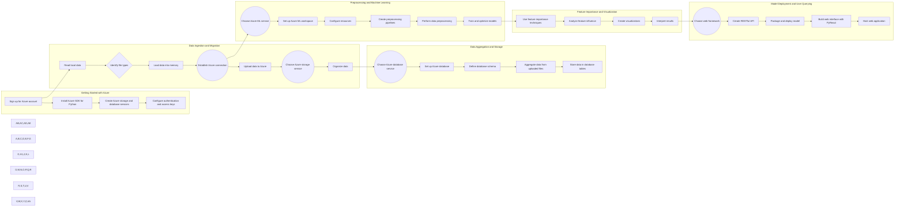

# System Design plan 

## Data Ingestion and Migration:
- Use Python to read data from the local drive, identify file types (H5, CSV, Feather, Parquet), and load them into memory.
- Utilize the Microsoft Azure SDK for Python to establish a connection to Azure storage.
- Use the SDK to upload the data files to an appropriate Azure storage service, such as Azure Blob Storage or Azure Data Lake Storage. Ensure to organize the data based on your requirements.

## Data Aggregation and Storage:
- Set up an Azure database service, such as Azure SQL Database or Azure Cosmos DB, for storing aggregated data.
- Define the schema for the database tables based on the structure of the aggregated data.
- Use Python to aggregate the data from the uploaded files and store it in the database tables.

## Preprocessing and Machine Learning:
- Utilize TensorFlow and Azure Machine Learning (AML) to perform preprocessing and machine learning tasks.
- Set up an Azure Machine Learning workspace and configure the necessary resources, such as compute targets and datastores, using the Azure SDK.
- Use Python and TensorFlow to create pipelines that preprocess the data, including steps like data cleaning, feature engineering, and normalization.
- Utilize AML to run experiments, track metrics, and manage model training and optimization.

## Feature Importance and Visualization:
- After training and optimizing your model, you can use techniques such as feature importance or SHAP (SHapley Additive exPlanations) values to determine the influence of features on model performance.
- Use Python visualization libraries like Matplotlib, Seaborn, or Plotly to create visualizations of feature importance.
- Visualize and interpret the results to gain insights into the model's behavior and feature contributions.

## Model Deployment and User Querying:
- You can utilize frameworks like Flask, FastAPI, or Django to create a RESTful API for your model.
- Package your trained model using TensorFlow's SavedModel format.
- Use the Python React package (presumably PyReact) to build a web interface for users to query the deployed model with natural language prompts.
- Host the web application on an appropriate platform, such as Azure App Service or Azure Kubernetes Service (AKS), based on your scalability and deployment requirements.

## Getting Started with Azure:
- Sign up for an Azure account if you haven't already.
- Install the Azure SDK for Python (azure-sdk-for-python) using pip: `pip install azure`.
- Follow the Azure documentation to create the required Azure storage service (e.g., Blob Storage, Data Lake Storage), database service (e.g., Azure SQL Database, Cosmos DB), and Azure Machine Learning workspace.
- Configure authentication and access keys to establish connections with Azure services.

## Python Packages:
Apart from the Azure SDK, you may need the following Python packages:
- TensorFlow: For machine learning and deep learning tasks.
- NumPy, Pandas: For data manipulation and preprocessing.
- Matplotlib, Seaborn, Plotly: For data visualization.
- Flask, FastAPI, or Django: For building the API and web application.
- PyReact (presumably): For building the web interface using React.f

